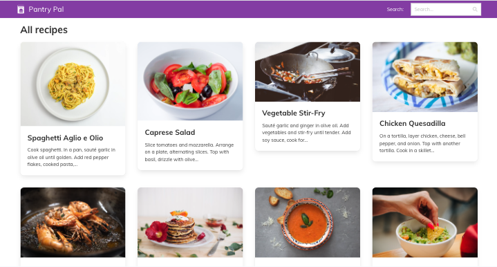

# Pantry Pal

Pantry Pal is a practical project that leverages Slick’s capabilities to create a useful tool,
demonstrating how even simple applications can provide value and engage users.
By focusing on static data, you can concentrate on learning the fundamentals of Slick without
getting bogged down in database management or backend complexity.

Whether you’re a beginner looking to get
started with Slick or an experienced developer wanting to brush up on core skills, this
project is the perfect starting point.

## Documentation

For a step-by-step guide on creating this application, check out the blog post
["Building Pantry Pal – A Recipe Search Application with Slick"](https://www.slick-framework.com/howtos/2024/08/25/building-pantry-pal-a-recipe-search-application-with-slick.html)
on the [Slick documentation site](https://www.slick-framework.com). This tutorial will walk
you through the process of building the Pantry Pal recipe search application from start to
finish.
